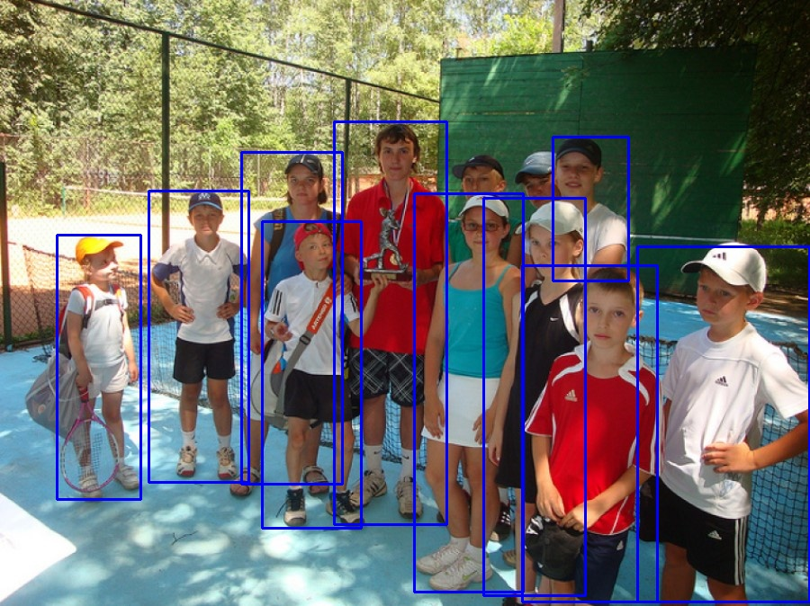
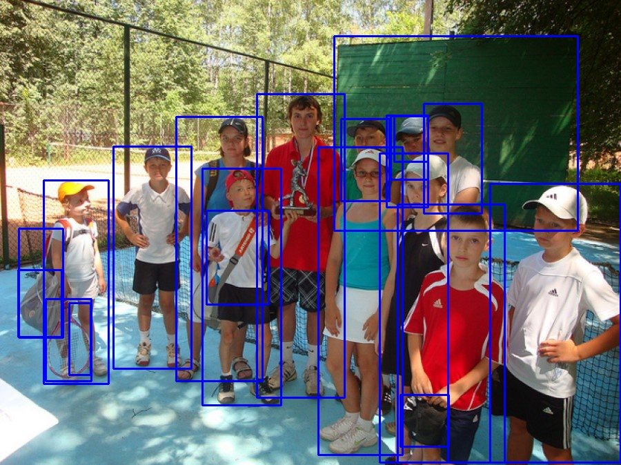
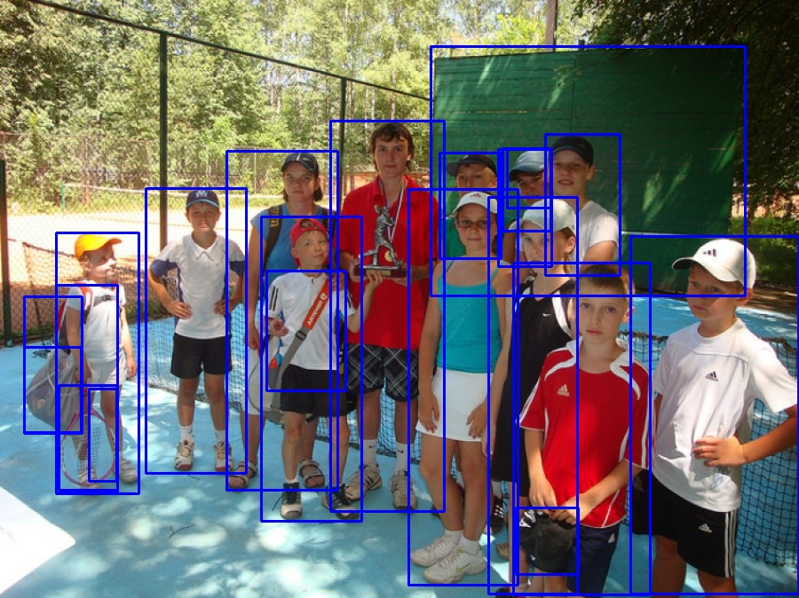

# EasyDeploy
<!-- PROJECT LOGO -->
 

  

  <h3 align="center">EasyDeploy</h3>

  

    Provides a easy way to deploy algorithms based on deep learning!
     
    <a href="https://github.com/zz990099/EasyDeploy/issues/new">Report Bug or Request Feature</a>
  

## About The Project

The engineering deployment of deep learning algorithms relies on various inference frameworks, which often differ significantly from one another. These differences lead to low deployment and migration efficiency, especially when there is a need to support multiple hardware platforms. 

The `EasyDeploy` project aims to address these challenges in two key ways:  

1. **Abstracting inference framework functionalities**: By decoupling the pre-processing and post-processing procedures of algorithms from the inference process of deep learning models, `EasyDeploy` enables rapid deployment and migration of algorithms across multiple inference frameworks and hardware platforms.  

2. **Asynchronous inference pipeline**: The project implements an asynchronous inference workflow, which significantly improves model inference throughput on platforms that support multi-core parallel inference.

### Features

1. Abstracting inference framework (hardware platform) characteristics to enable efficient algorithm deployment and migration.  

2. Asynchronous inference pipeline to improve workflow throughput.  

3. Supporting segmented and distributed model inference, enabling asynchronous inference across devices such as CPU, GPU and NPU.

### Models and Inference Frameworks Supported 

- **Deployed Inference Frameworks**:  
  1. TensorRT  
  2. ONNX-Runtime  
  3. RKNN

- **Deployed Algorithms**:  
  1. YOLOv8  
  2. RT-DETR  
  3. MobileSAM  
  4. NanoSAM

## Demo test Results

The following test results showcase the visualized reasoning outcomes of the algorithm and its inference throughput.

- Noted that, the asynchronous inference framework can significantly boost the throughput of certain algorithm models. But the latency of the inference workflow is not improved.
- The metrics in the table below represent the model's throughput, not its average latency.

### RK3588

- All results are tested on `Orangepi-5plus 16GB`

|  |  |
|:----------------------------------------:|:----------------------------------------:|
| **yolov8(int8) test result on rk3588**  | **nanosam(int8+fp16) test result on rk 3588** |

|  rk3588   |   sync   |  async   |
|:---------:|:---------:|:----------------:|
|  yolov8(int8)   |   27.20   |  39.72 (1-npu)   |
|  yolov8(int8)   |   27.20   |  136.509 (3-npu) |
|  nanosam(int8+fp16)  |   4.00    |  17.00 (2+2-npu) |

### Nvidia-GPU

- All results are tested on `NVIDIA GeForce RTX 4060-8G`.

|  |  |
|:----------------------------------------:|:----------------------------------------:|
| **yolov8(fp16) test result on nvidia-gpu**  | **rt-detr(fp32) test result on nvidia-gpu** |
|  |  |
| **mobilesam(fp32+fp16) test result on nvidia-gpu**  | **nanosam(fp16+fp16) test result on nvidia-gpu** |

|  nvidia-gpu   |   sync   |  async   |
|:---------:|:---------:|:----------------:|
|  yolov8(fp16)   |   434   |  625   |
|  rt-detr(fp32)   |   142   |  142 |
|  mobilesam(fp32+fp16)  |   38    |  48 |
|  nanosam(fp16+fp16)  |   117    |  198 |

### OnnxRuntime

- All results are tested on `RK3588 CPU`

|  |  |
|:----------------------------------------:|:----------------------------------------:|
| **yolov8(fp32) test result on rk3588-cpu**  | **rt-detr(fp32) test result on rk3588-cpu** |
|  |  |
| **mobilesam(fp32+fp32) test result on rk3588-cpu**  | **nanosam(fp32+fp32) test result on rk3588-cpu** |

|  rk3588-cpu   |   sync   |  async   |
|:---------:|:---------:|:----------------:|
|  yolov8(fp32)   |   6.3   |  6.3   |
|  rt-detr(fp32)   |   1.17   |  1.17 |
|  mobilesam(fp32+fp32)  |   0.57    |  0.57 |
|  nanosam(fp32+fp32)  |   0.87    |  0.87 |

## Getting Started

### Dependency

- The `EasyDeploy` project is entirely written in C++ and built using the CMake tool. It relies on the following dependencies:  
    - **OpenCV**  
    - **CMake**  
    - **glog**  
    - **GoogleTest**  
    - Specific dependencies for each **inference framework**

### Environment Build
- Follow [EnvironmentSetup](doc/EnviromentSetup.md) to setup enviroment with scripts quickly. 

## What You Could Do With This Project

EasyDeploy aims to minimize the impact of inference framework-specific characteristics on the deployment of deep learning algorithms. To achieve this, we have developed an abstract base class named BaseInferCore and created specialized base classes for certain types of algorithms, such as 2D detection and instance segmentation.

Additionally, EasyDeploy provides an asynchronous inference pipeline to further enhance deployment efficiency. 

With these features, EasyDeploy offers the following capabilities:

- **Direct use of pre-implemented algorithms**:
    - If you need to directly use algorithms such as YOLOv8, RT-DETR, MobileSAM, NanoSAM, MixFormer, or FoundationPose, EasyDeploy has already implemented and optimized their deployment.
    - [QuickStart](doc/QuickStart.md) may help.

- **Deploying a new algorithm efficiently**:
    - If you need to deploy a new algorithm without worrying about the specific implementation details of inference frameworks, or if you want to easily migrate your algorithm to other inference frameworks, the BaseInferCore abstract base class can help you quickly implement and migrate the algorithm.
    - [HowToDeployModels](doc/HowToDeployModels.md) may help.

- **Migrating algorithms to a new inference framework**:
    - If you want to migrate algorithms based on BaseInferCore to a new inference framework, implementing a subclass of BaseInferCore will allow you to migrate all algorithms to the new framework with ease.
    - [HowToDeployModels](doc/HowToDeployModels.md) may help.

- **Improving inference throughput**:
    - If you need to increase the throughput of algorithm inference, EasyDeploy provides an asynchronous inference pipeline. For certain algorithm types (e.g., 2D detection, SAM), asynchronous base classes are already available, enabling you to boost the throughput of your models with minimal effort.

- **Segmented distributed asynchronous inference**:
    - If you need to implement simple segmented, distributed, asynchronous inference for algorithms, the abstract base classes and asynchronous pipeline features provided in EasyDeploy make it easy to achieve this functionality.

## Todo

- [ ] Use `rga` library on rk3588 to do image pre-process.
- [x] Update ONNX-Runtime inference core code and test it out.
- [ ] Test TensorRT inference framework on jetson platform.
